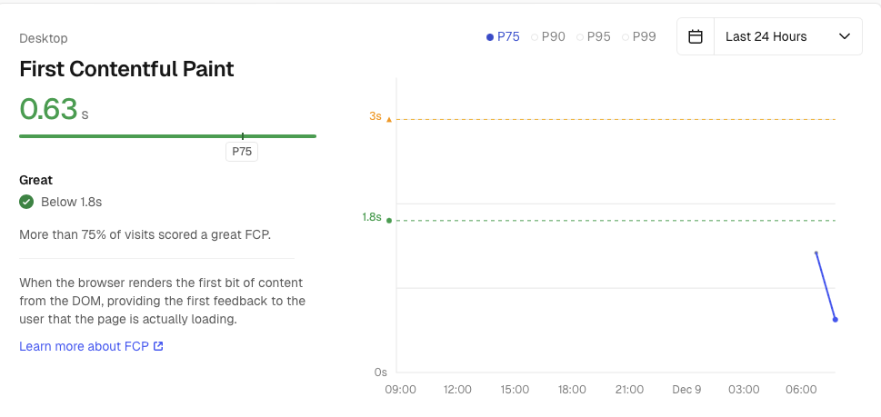

# IntelliBank 💳

IntelliBank é uma aplicação bancária simples desenvolvida com React, projetada para gerenciar cadastros e transações financeiras. Este projeto foi criado com foco em simplicidade e rapidez, utilizando LocalStorage para persistência de dados e Context API para gerenciamento de estados globais.


## 🚀 Funcionalidades

	•	Cadastro de Clientes: Registro de novos usuários no sistema.
	•	Depósitos e Transações: Realize depósitos e visualize o histórico de transações.
	•	Gerenciamento de Saldo: Controle e exibição de saldos atualizados.
	•	Armazenamento Local: Persistência de dados através do LocalStorage.
	•	Desempenho Monitorado: Métricas de performance obtidas pelo Speed Insights.


## 📂 Estrutura do Projeto

```
src/
├── components/         # Componentes reutilizáveis da aplicação
├── config/             # Configurações gerais do projeto
├── i18n/               # Definição dos idiomas suportados
├── models/             # Definição das interfaces usadas (ex.: User, Transaction)
├── pages/              # Componentes das páginas principais
├── routes/             # Gerenciamento de rotas publicas e privadas
├── context/            # Configuração do Context API para variáveis globais
├── utils/              # Funções auxiliares como formatação de valores
└── App.js              # Entrada principal da aplicação
```


## 🛠️ Tecnologias Utilizadas

	•	React: Biblioteca principal para construção da interface do usuário.
	•	Context API: Gerenciamento de estados globais de forma simples e eficiente.
	•	LocalStorage: Persistência de dados do cliente no navegador.
	•	Speed Insights: Análise e otimização de desempenho da aplicação.


## 🏗️ Por que essas escolhas?

	•	Context API: Escolhida por sua simplicidade e eficiência em aplicações de pequeno a médio porte.
	•	LocalStorage: Uma solução rápida e prática para armazenar os dados de clientes e transações localmente.
	•	Separação de Lógica e Componentes: Para manter o código limpo, a lógica está encapsulada em hooks dentro da pasta hooks, deixando os componentes responsáveis apenas pela interface.


## 📈 Métricas de Desempenho

Utilizei o Speed Insights para monitorar e otimizar o desempenho da aplicação, garantindo uma experiência fluida para o usuário.


## Rodando localmente

Clone o projeto

```bash
  git clone https://github.com/LeandroSmFreitas/intelibank-web.git
```

Entre no diretório do projeto

```bash
  cd intelibank-web
```

Instale as dependências

```bash
  yarn
```

Inicie o servidor

```bash
  yarn dev
```

